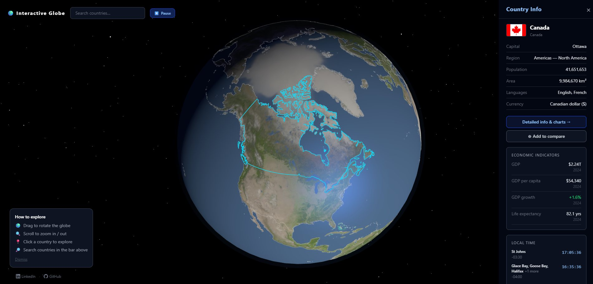

# 🌍 Interactive Globe

A portfolio-quality, browser-based 3D globe for exploring country data. Built with Vue 3, Three.js, and Tailwind CSS v4.



---

## Features

- **Photorealistic 3D Earth** — 8K day texture, ambient + real-time solar lighting, ~3000-star particle field
- **Real-time solar position** — the day/night terminator updates every frame from actual UTC time, solar declination, and hour angle
- **Country borders** — ~250 countries rendered via TopoJSON (50m resolution) as `LineSegments` overlaid on the sphere
- **Hover & click highlighting** — hover turns a country's border yellow; clicking selects it (cyan) and flies the camera in
- **Country sidebar** — flag, official name, capital, region, population, area, languages, currencies, and live local time(s)
- **Live local time** — ticks every second, DST-correct, grouped by IANA timezone name (handles multi-timezone countries like Russia)
- **Economic indicators** — latest GDP, GDP per capita, GDP growth (color-coded), and life expectancy from the World Bank API
- **25-year sparkline charts** — full-screen modal with SVG area charts + bar charts for GDP, population, life expectancy, and GDP growth
- **Country comparison** — compare up to 4 countries side-by-side with multi-series SVG line charts and distinct per-country colors
- **Search bar** — live typeahead over ~250 countries; selecting one flies the camera there
- **Rotate / Pause** — toggle globe auto-rotation
- **Drag-vs-click guard** — pointer movement > 5 px is treated as an orbit drag, never a selection

---

## Tech Stack

| Layer        | Technology                                                   |
| ------------ | ------------------------------------------------------------ |
| Framework    | Vue 3 — Composition API, `<script setup>` throughout         |
| 3D rendering | Three.js `^0.174` — WebGLRenderer, OrbitControls, raycasting |
| Map data     | `topojson-client` + `world-atlas` (50m TopoJSON)             |
| Styling      | Tailwind CSS v4 via `@tailwindcss/vite` (no CDN)             |
| Build tool   | Vite `^6.3`                                                  |
| Timezones    | `countries-and-timezones` (IANA-aware, DST-correct)          |
| Language     | Plain JavaScript — no TypeScript                             |

No Pinia, no Vue Router, no charting library. Charts are hand-rolled SVG.

---

## External APIs

| API                                              | Usage                                                                       |
| ------------------------------------------------ | --------------------------------------------------------------------------- |
| [REST Countries v3.1](https://restcountries.com) | Country list, flags, capitals, languages, currencies, timezones             |
| [World Bank API](https://data.worldbank.org)     | GDP, GDP per capita, GDP growth, life expectancy (latest + 25-year history) |

No auth tokens. No paid APIs. No backend.

## Credits

**Earth texture** — The surface texture (`public/textures/8k_earth_daymap.jpg`) is the **8K Earth Day Map** from [Solar System Scope](https://www.solarsystemscope.com/textures/), distributed under [CC BY 4.0](https://creativecommons.org/licenses/by/4.0/).

**Country borders** — Border geometry is sourced from the [`world-atlas`](https://github.com/topojson/world-atlas) npm package (`countries-50m.json`), which is derived from [Natural Earth](https://www.naturalearthdata.com/) data.

---

## Getting Started

### Prerequisites

- Node.js ≥ 18
- npm

### Install & run

```bash
git clone https://github.com/your-username/interactive-globe.git
cd interactive-globe
npm install
npm run dev
```

The app opens at `http://localhost:5173`.

### Build for production

```bash
npm run build      # outputs to dist/
npm run preview    # serve the production build locally
```

### CORS note (World Bank API)

During development, Vite proxies `/wb-api/*` → `https://api.worldbank.org/v2/country/*` to avoid CORS errors from `localhost`. This proxy is **not** needed in production — the World Bank API allows CORS from real origins. The composable `useWorldBankTimeseries.js` switches URLs automatically via `import.meta.env.DEV`.

---

## Architecture Notes

- **Singleton composables** — `useApi`, `useCountriesStore`, and `useCompare` use module-level refs so every component shares the same reactive state without Pinia.
- **Z-fighting** is avoided by layering geometry at precise offsets above the sphere surface: base borders at `+0.001`, hover/active highlights at `+0.002`–`+0.006`.
- **Hit-testing pipeline**: 3D raycast point → `vector3ToLonLat()` → 2D ray-casting point-in-polygon against GeoJSON rings → ISO numeric → alpha-2 via `isoNumeric.js`.
- **Hand-rolled SVG charts** compute `path d` attributes directly from data arrays using linear-scale helpers. Per-series normalization prevents small countries from visually flatlining next to large ones, except for GDP growth which uses a shared absolute scale.

---

## License

MIT
